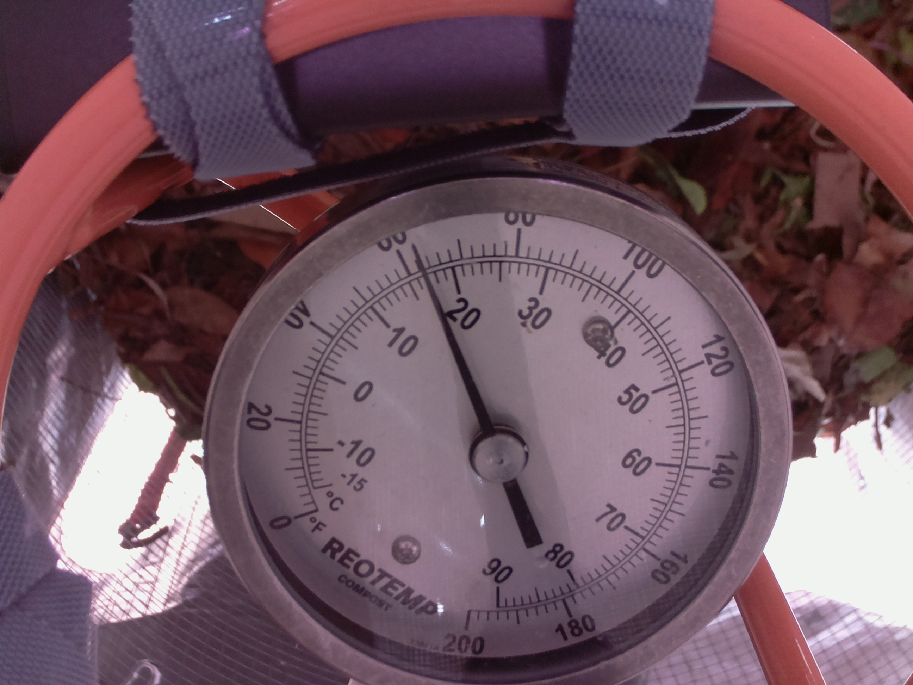

= Converting Analogue Thermometer Dial photo to digital reading

This is a logistic regression problem:

- input: images
- labels: floating point number - temperature reading

.Example training example

.Corresponding label in Fahrenheit:
include::data/labels/001.txt[]
